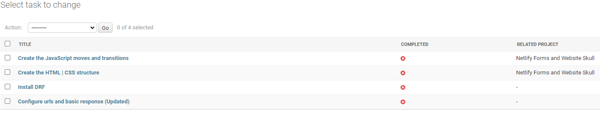

# Walkthrough

## Sommaire

[Terminer les settings](#terminer-les-settings)

[Enregistrer les modèles](#on-enregistre-un-model)


[Enregistrer l'admin](#on-enregistre-l'admin)

[Enregistrer le serializer](#on-enregistre-le-serializer)

[Enregistrer les vues](#on-enregistre-les-vues)
> [Vue d'ensemble de l'api](#vue-d'ensemble-de-l'api)
> [Liste et détail des taches](#liste-et-détail-des-taches)
> [Création des taches](#permettre-la-création-de-taches)
> [Update des taches](#permettre-l'update-de-tache)
> [Suppression des taches](#permettre-la-suppression-de-tache)

[Création des Urls](#on-crée-les-urls)

[App Frontend](#créer-l'app-frontend)
> [Ajouter l'app dans settings](#ajouter-l'app-dans-settings)
> [Créer la vue](#créer-la-vue-app-frontend)
> [Créer les url](#créer-les-urls-app-frontend)
> [Créer le gabarit des tâches](#gabarit-des-taches)
> [Créer le css des tâches](#css-des-taches)
> [Créer le JS des taches](#javascript-des-taches)


---
---

[top](#sommaire)
## terminer les settings
```python
INSTALLED_APPS = [
    'django.contrib.admin',
    'django.contrib.auth',
    'django.contrib.contenttypes',
    'django.contrib.sessions',
    'django.contrib.messages',
    'django.contrib.staticfiles',

    'api.apps.ApiConfig',

    'rest_framework',
]
ROOT_URLCONF = 'todo_drf.urls'
WSGI_APPLICATION = 'todo_drf.wsgi.application'
STATIC_URL = '/static/'
```

---
---

[top](#sommaire)
## on enregistre un model
<!-- models.py -->
```python
class Task(models.Model):
    """_summary_

    Args:
        models (_type_): _description_

    Returns:
        _type_: _description_
    """
    title = models.CharField(max_length=200)
    completed = models.BooleanField(default=False, blank=True, null=True)
    related_project = models.ForeignKey(
        'Project', on_delete=models.CASCADE, null=True, blank=True
    )

    def __str__(self):
        return str(self.title)
```

---
---

[top](#sommaire)
## On enregistre l'admin
<!-- admin.py -->
```python
from django.contrib import admin
from .models import Task


@admin.register(Task)
class TaskAdmin(admin.ModelAdmin):
    list_display = ('title', 'completed', 'related_project')
```

**Les tasks dans l'admin django**


---
---

[top](#sommaire)
## On enregistre le serializer
<!-- serializers.py -->

```python
from rest_framework import serializers
from .models import Task


class TaskSerializer(serializers.ModelSerializer):
    """_summary_

    Args:
        serializers (_type_): _description_
    """
    class Meta:
        """_summary_
        """
        model = Task
        fields = '__all__'
```

---
---

## On enregistre les vues
<!-- views.py -->

[top](#sommaire)
### Vue d'ensemble de l'api
```python
"""On importe api_view, le serializer et le model"""
from rest_framework.decorators import api_view
from rest_framework.response import Response
from .serializers import TaskSerializer
from .models import Task


"""
le décorateur api_view sert à afficher
les endpoints de l'API depuis l'url 
http://127.0.0.1:8000/api/
"""
@api_view(["GET"])
def apiOverview(request):
    api_urls = {
        "List": "/task-list/",
        "Detail View": "/task-detail/<str:the_id>/",
        "Create": "/task-create/",
        "Update": "/task-update/<str:the_id>/",
        "Delete": "/task-delete/<str:the_id>/",
    }

    return Response(api_urls)
```

**L'overview**


---

[top](#sommaire)
### Liste et détail des taches
```python
@api_view(["GET"])
def task_list(request):
    """_summary_

    Args:
        request (_type_): _description_

    Returns:
        _type_: _description_
    """
    tasks = Task.objects.all().order_by("-id")
    serializer = TaskSerializer(tasks, many=True)
    return Response(serializer.data)


@api_view(["GET"])
def task_detail(request, the_id):
    """_summary_

    Args:
        request (_type_): _description_
        the_id (_type_): _description_

    Returns:
        _type_: _description_
    """
    tasks = Task.objects.get(id=the_id)
    serializer = TaskSerializer(tasks, many=False)
    return Response(serializer.data)
```

---

[top](#sommaire)
### Permettre la création de taches

```python
@api_view(["POST"])
def task_create(request):
    """_summary_

    Args:
        request (_type_): _description_

    Returns:
        _type_: _description_
    """
    serializer = TaskSerializer(data=request.data)

    if serializer.is_valid():
        serializer.save()

    return Response(serializer.data)
```

---

[top](#sommaire)
### Permettre l'update de tache

```python
@api_view(["POST"])
def task_update(request, the_id):
    """_summary_

    Args:
        request (_type_): _description_
        the_id (_type_): _description_

    Returns:
        _type_: _description_
    """
    task = Task.objects.get(id=the_id)
    serializer = TaskSerializer(instance=task, data=request.data)

    if serializer.is_valid():
        serializer.save()

    return Response(serializer.data)
```

---

[top](#sommaire)
### Permettre la suppression de tache

```python
@api_view(["DELETE"])
def task_delete(request, the_id):
    """_summary_

    Args:
        request (_type_): _description_
        the_id (_type_): _description_

    Returns:
        _type_: _description_
    """
    task = Task.objects.get(id=the_id)
    task.delete()
    
    return Response("Item succsesfully delete!")
```

---
---

[top](#sommaire)
## On crée les URLS
<!-- urls.py -->

```python
# Dans le dossier qui contient settings
from django.contrib import admin
from django.urls import path, include

urlpatterns = [
    path('admin/', admin.site.urls),
    path('api/', include('api.urls')),
]

# Puis dans le dossier de l'app concernée
from django.urls import path
from . import views


urlpatterns = [
    path('', views.apiOverview, name="api-overview"),
    path('task-list/', views.task_list, name="task-list"),
    path('task-detail/<str:the_id>/', views.task_detail, name="task-detail"),
    path('task-create/', views.task_create, name="task-create"),
    path('task-update/<str:the_id>/', views.task_update, name="task-update"),
    path('task-delete/<str:the_id>/', views.task_delete, name="task-delete"),
]
```

**Endpoint http://127.0.0.1:8000/api/task-list/**


**Endpoint http://127.0.0.1:8000/api/task-detail/2/**


---
---

[top](#sommaire)
## Créer l'app Frontend

`py manage.py startapp frontend`
Cette nouvelle app va récupérer les données, à partir de l'Api et nous allons y référencer les urls pour la visualisation

### Ajouter l'app dans settings

```python
INSTALLED_APPS = [
    'django.contrib.admin',
    'django.contrib.auth',
    'django.contrib.contenttypes',
    'django.contrib.sessions',
    'django.contrib.messages',
    'django.contrib.staticfiles',

    'api.apps.ApiConfig',
    'frontend.apps.FrontendConfig',

    'rest_framework',
]
```

---

[top](#sommaire)
### Créer la vue app frontend

```python
from django.shortcuts import render


def list(request):
    return render(request, "frontend/list.html")
```

---

[top](#sommaire)
### Créer les urls app frontend

```python
"""Depuis dossier racine urls.py"""
path('', include('frontend.urls')),

"""Depuis dossier frontend urls.py"""
from django.urls import path
from . import views


urlpatterns = [
    path('', views.list, name="list"),
]
```

---
---


[top](#sommaire)
### Gabarit des taches

On crée le dossier templates à la racine du dossier de projet
puis on crée le gabarit de base pour qu'il soit étendu par les
autres pages.

```html

<html lang="en">
    <head>
        <meta charset="UTF-8" />
        <meta http-equiv="X-UA-Compatible" content="IE=edge" />
        <link rel="stylesheet" href="" />
        <title></title>
    </head>

    <body>
        
        
    </body>
</html>
```

Le dossier statique est directement placé dans le dossier de l'app
frontend afin de rassembler tous les dossiers attenants à celui-ci.

```python
STATIC_URL = '/todo_drf/static/'
MEDIA_URL = '/media/'
MEDIA_ROOT = 'media/'
```

On crée le dossier templates dans le dossier de l'app frontend,
puis le fichier list.html à l'intérieur.

```html

<title>MPM Tasks</title>

    <h1 id="tasks_title">Tasks</h1>
    <section id="tasks_container">
        <div id="task-container">
            <div id="form_wrapper">
                <form id="form">
                    <input type="text" id="title" name="title" class="form-control" placeholder="Titre de la tache"/>
                    <input type="submit" id="submit" class="btn">
                    <p id="nb_of_tasks"></p>
                </form>
            </div>
            <div id="list_wrapper"></div>
        </div>
    </section>
    

    <script src=""></script>
    <script src=""></script>

```

On a un formulaire destiné à créer des todos et son conteneur contient également
une pastille qui indique le nombre de taches existantes


---
---

[top](#sommaire)
### CSS des taches

On crée le reset css maison et on importe la police de caractère 
à utiliser sur toute la page.

```scss
@import url('https://fonts.googleapis.com/css2?family=Montserrat&display=swap');


body {
    font-family: 'Montserrat', sans-serif;
    background: rgb(66,133,244);
background: linear-gradient(90deg, rgba(66,133,244,1) 0%, rgba(66,133,244,1) 35%, rgba(219,68,55,1) 100%);
    margin: 30px 0;
    padding: 0;
    box-sizing: border-box;
    overflow-x: hidden;
}

h1, h2, h3, h4, h5, p, span, strong, strike, a {
    font-family: 'Montserrat', sans-serif;
}
```

Ensuite, on s'occupe du contenu

```scss
// Le titre principal
#tasks_title {
    text-align: center;
    color: #222;
    margin-bottom: -50px;
    text-shadow: 0 3px 5px #222;
}

//------------------------------------------------------------

// Le formulaire
#title{
    flex: 6;
}

#submit{
    flex: 1;
}

//------------------------------------------------------------

// Le container du formulaire et du conteneur
// de taches

#tasks_container{
    width: 100%;
    height: auto;
    #task-container {
        width: 100%;
        height: auto;
        margin: 100px auto;
        display: flex;
        flex-direction: column;
        justify-content: center;
        align-items: center;

        // Le conteneur du formulaire
        #form_wrapper {
            width: 100%;
            height: auto;
            position: -webkit-sticky;
            position: sticky;
            z-index: 6;
            top: 0;


            // Le formulaire
            #form {
                width: 70%;
                height: auto;
                display: flex;
                justify-content: center;
                align-items: center;
                background-color: #fff;
                margin: 0 auto;
                padding: 50px;
                box-shadow: 0 3px 8px rgba(0,0,0,0.25);
                gap: 30px;
                border-radius: 5px;

                // La pastille du nombre de taches
                #nb_of_tasks {
                    position: relative;
                    display: flex;
                    justify-content: center;
                    align-items: center;
                    top: -60px;
                    right: -30px;
                    font-size: 21px;
                    font-weight: bold;
                    color: #DB4437;
                    background-color: #fff;
                    border-radius: 50%;
                    padding: 10px;
                    width: 15px;
                    height: 15px;
                    box-shadow: 0 9px 10px rgba(0,0,0,0.25);
                }

                // Le champ du formulaire et le bouton submit
                #title, #submit {
                    min-height: 50px;
                    padding: 10px;
                    font-size: 21px;
                    border: none;
                }

                // Le champ du formulaire
                #title {
                    width: 70%;
                    box-shadow: 0 3px 8px rgba(0,0,0,0.25);
                    border-radius: 5px;
                    &:focus {
                        outline: none;
                        animation: growbottom 0.5s both;
                    }
                }

                // Le bouton submit
                #submit {
                    width: 30%;
                    background-color: #fff;
                    color: #4285F4;
                    border: 2px solid #4285F4;
                    font-weight: bold;
                    border-radius: 5px;
                    box-shadow: 0 9px 10px rgba(0,0,0,0.25);
                    &:hover {
                        animation: changecolor 1s both;
                    }
                }

            }
        }

        // Le conteneur des taches
        #list_wrapper {
            display: flex;
            flex-direction: column;
            align-items: center;
            justify-content: center;
            gap: 20px;
            width: 73%;
            margin: 50px auto;

            // Le conteneur d'une tache
            .task_wrapper {
                width: 100%;
                display: flex;
                align-items: center;
                justify-content: space-between;
                box-shadow: 0 9px 10px rgba(0,0,0,0.25);
                padding: 20px;
                border-radius: 5px;
                background-color: #fff;
                color: white;
                font-weight: bold;
                span.title {
                    font-size: 18px;
                    color: #222;
                }
                button {
                    border: none;
                    border-radius: 5px;
                    color: white;
                    font-weight: bold;
                    font-size: 16px;
                    box-shadow: 0 9px 10px rgba(0,0,0,0.25);
                }


                // Les boutons d'une tache
                .the_buttons {
                    width: 26%;
                    display: flex;
                    justify-content: center;
                    align-items: center;
                    gap: 10px;
                }
            }
        }
    }
}
```

Astuces CSS

```scss
// Petite astuce servant à placer un position
// relative au centre de l'écran
#details_wrapper {
    position: absolute;
    top: 50%; left: 50%; /* à 50%/50% du parent référent */
    transform: translate(-50%, -50%); /* décalage de 50% de sa propre taille */
    z-index: 15;

// comment utiliser des key frames
@-webkit-keyframes slide-out-bck-center { // => Le nom de la keyframe
    0% {
      -webkit-transform: translateZ(0);
              transform: translateZ(0);
      opacity: 1;
    }
    100% {
      -webkit-transform: translateZ(-1100px);
              transform: translateZ(-1100px);
      opacity: 0;
    }
}

// Soit on appelle cette keyframe directement dans le sélecteur
# selecteur {
    &:hover {
        animation: slide-out-bck-center 1s ease-out both;
    }
}

// soit dans la balise html concernée

.slide-out-bck-center {
	-webkit-animation: slide-out-bck-center 0.5s cubic-bezier(
        0.550,
        0.085,
        0.680,
        0.530
    )
    both;
	animation: slide-out-bck-center 0.5s cubic-bezier(
        0.550,
        0.085,
        0.680,
        0.530
    )
    both;
}
```

```html
<div id="form_wrapper" class="slide-out-bck-center">
</div>
```

---
---


[top](#sommaire)
### Javascript des taches

On crée un fichier display_task_list.js

```javascript
function getCookie(name) {
    let cookieValue = null;
    if (document.cookie && document.cookie !== '') {
        const cookies = document.cookie.split(';');
        for (let i = 0; i < cookies.length; i++) {
            const cookie = cookies[i].trim();
            // Does this cookie string begin with the name we want?
            if (cookie.substring(0, name.length + 1) === (name + '=')) {
                cookieValue = decodeURIComponent(
                    cookie.substring(name.length + 1)
                );
                break;
            }
        }
    }
    return cookieValue;
}
const csrftoken = getCookie('csrftoken');

var active_item = null;

buildList()

function buildList(){
    var wrapper = document.getElementById('list_wrapper')
    wrapper.innerHTML = ''

    var nb_tasks = document.getElementById('nb_of_tasks')

    var url = "http://127.0.0.1:8000/api/task-list/"

    fetch(url)
    .then((resp) => resp.json())
    .then(function(data) {
        console.log('Data:', data)

        var list = data
        for (var i in list) {

            title = `<span class="title">${list[i].title}</span>`

            var item = `
                <div id="data_row_${i}" class="task_wrapper flex_wrapper">
                    <div style="width:60%; text-align:left;">
                        ${title}
                    </div>
                    <div class="the_buttons">
                        <button style="width:90px; padding:15px;background-color:#4285F4;" class="edit">Edit</button>
                        <button style="width:90px; padding:15px;background-color: #DB4437;" class="delete">Delete</button>
                    </div>
                </div>
            `
            wrapper.innerHTML += item;
        }

        for (var i in list) {
            let editBtn = document.getElementsByClassName('edit')[i]
            let deleteBtn = document.getElementsByClassName('delete')[i]
            let title = document.getElementsByClassName('title')[i]

            if (list[i].completed) {
                var parent = document.getElementById(`data_row_${i}`)
                parent.style.textDecoration = 'line-through'
                parent.style.opacity = '0.2'
            }

            editBtn.addEventListener('click', (function(item) {
                return function() {
                    edit_item(item)
                }
            })(list[i]))


            deleteBtn.addEventListener('click', (function(item) {
                    return function() {
                        delete_item(item)
                    }
                    
            })(list[i]))


            title.addEventListener('click', (function(item) {
                return function() {
                    strike_unstrike(item)
                }
                
            })(list[i]))
        }

        nb_tasks.innerHTML = list.length
    })
}

var form_wrapper = document.getElementById('form_wrapper')

form_wrapper.addEventListener('submit', (e) => {
    e.preventDefault()
    console.log('Form submitted')
    var url = "http://127.0.0.1:8000/api/task-create/"

    if (active_item != null) {
        var url = `http://127.0.0.1:8000/api/task-update/${active_item.id}/`
        active_item = null
    }

    var title = document.getElementById('title').value
    fetch(url, {
            method: 'POST',
            headers: {
                'Content-Type': 'application/json',
                'X-CSRFToken': csrftoken,
            },
            body: JSON.stringify({
                title: title
            })
        }
    ).then(function(response) {
        buildList()
        document.getElementById('form').reset()
    })
})

// EDIT ITEM

function edit_item(item) {
    active_item = item
    document.getElementById('title').value = active_item.title
}

// DELETE ITEM

function delete_item(item) {
    fetch(`http://127.0.0.1:8000/api/task-delete/${item.id}/`, {
        method: 'DELETE',
        headers: {
            'Content-Type': 'application/json',
            "X-Requested-With": "XMLHttpRequest",
            'X-CSRFToken': csrftoken,
        },
    }).then((response) => {
        buildList()
    })
}

// STRIKE UNSTRIKE ITEM

function strike_unstrike(item) {
    item.completed = !item.completed
    fetch(`http://127.0.0.1:8000/api/task-update/${item.id}/`, {
        method: 'POST',
        headers: {
            "X-Requested-With": "XMLHttpRequest",
            'Content-Type': 'application/json',
            'X-CSRFToken': csrftoken,
        },
        body: JSON.stringify({'title': item.title, 'completed': item.completed})
    }).then((response) => {
        buildList()
    })
}
```